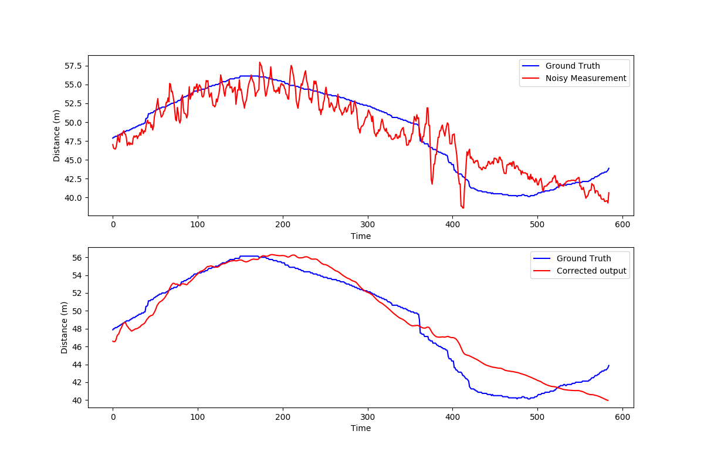

### Motivation 
This was the experiment I tried while learning about Kalman Filters. Here, the points (1d point) from a noisy sensor measurement,needs to be filtered out. And as we have the groundtruth points it is easy to see if it works. Below figure shows the output before and after applying the Kalman Filter. (Still can be tuned further)

### System Setup
Make sure your system have the following:
1. CMake (>=3.5)
2. matplotlib
3. Eigen3

### Building and running the code

1. Create a build directory if doesn't exist. 
2. cmake ..
3. make -j$(nproc)
4. ./kf_example

